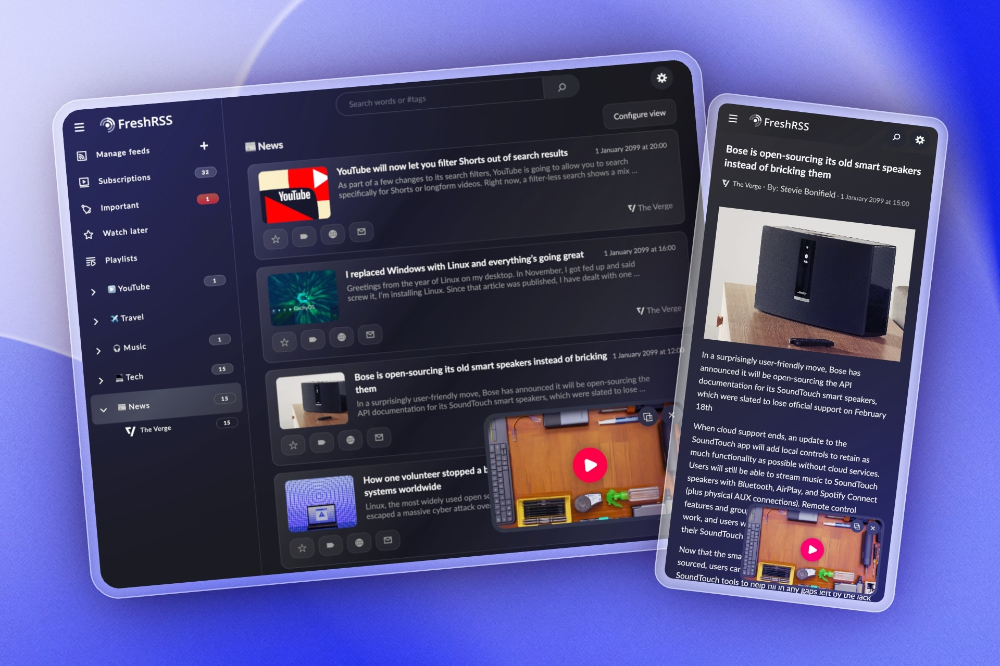

<h1 align="center">
  

   Youlag
</h1>

<h2 align="center">
   Modernize FreshRSS for viewing YouTube and articles
</h2>

   
   

## About
Youlag is an extension for [FreshRSS](https://github.com/FreshRSS/FreshRSS), allowing you to browse YouTube and article feeds through a modernized design that incorporates quality-of-life features.

Optimized for both watching videos and reading articles.

## Table of Content
- [Features](#features)
- [Install](#install)
- [Update](#update)
- [Additional Resources](#additional-resources)
- [Contribution](#contribution)
- [Attributions](#attributions)

## Features

- 📺 **Videos & Articles**
  - Browse YouTube subscriptions through a video-tailored inferface
  - Mini player: keep video in corner while reading articles
  - Modernized article viewing experience
- ⚙️ **Customization**
  - Block YouTube shorts
  - Apply video mode layout to chosen categories
  - Switch between YouTube and Invidious playback sources
- 🖥️ **Desktop & Mobile**
  - Mobile: Swipe down in video mode to activate mini player
  - Use `Esc` key or the browser's `Back` navigation to exit videos and articles
  - Mobile friendly, better one-handed navigation
- 📰 **FreshRSS features**
  - Subscribe to YouTube creators without needing an account
  - Manage article and video RSS feeds

## Install

Before installing Youlag, please make sure to update FreshRSS to `1.28.0` or higher.

1. Download the [latest release here](https://github.com/civilblur/youlag/releases).

1. Unzip the file and you'll find a folder named `xExtension-Youlag`.

1. Move the `xExtension-Youlag` folder into your FreshRSS installation: `freshrss/extensions/`.

1. In FreshRSS, go to `Settings → Extensions` and enable the `Youlag` extension.
    - Click the gear (⚙️) icon to explore the available settings.

## Update

1. Delete the old version of Youlag: `freshrss/extensions/xExtension-Youlag`.

1. Repeat the same steps from the ["Install" instructions](#install).

## Additional resources
- [Video Background Play Fix](https://addons.mozilla.org/en-US/firefox/addon/video-background-play-fix/)
    - Enables background playback of YouTube videos in Firefox-based browsers on Android devices.
- [Invidious](https://invidious.io/)
    - An open source alternative front-end to YouTube.

## Contribution

1. Fork the `dev` branch.
1. Install dependencies: `npm i`.
1. Run `npm run watch` to compile files to `/static`.
    1. For local development, see `.env.example` to learn how you can sync your changes directly to FreshRSS' extensions folder.
1. Run `npm run build` to generate a production build to `/dist`.

## Attributions

- **Integration**: [Korbak/freshrss-invidious](https://github.com/Korbak/freshrss-invidious)
- **Icons used/remixed**: [SVG Repo](https://www.svgrepo.com/collection/design-and-development-elements/), [krystonschwarze](https://www.svgrepo.com/author/krystonschwarze/), [phosphor](https://www.svgrepo.com/author/phosphor/), [Solar Icons](https://www.svgrepo.com/svg/529779/playlist), [Dazzle UI](https://www.svgrepo.com/author/Dazzle%20UI/), [n3r4zzurr0/svg-spinners](https://github.com/n3r4zzurr0/svg-spinners).
- **Tools**: [SVGOptimizer](https://jakearchibald.github.io/svgomg/).

## License

GNU General Public License v3.0
