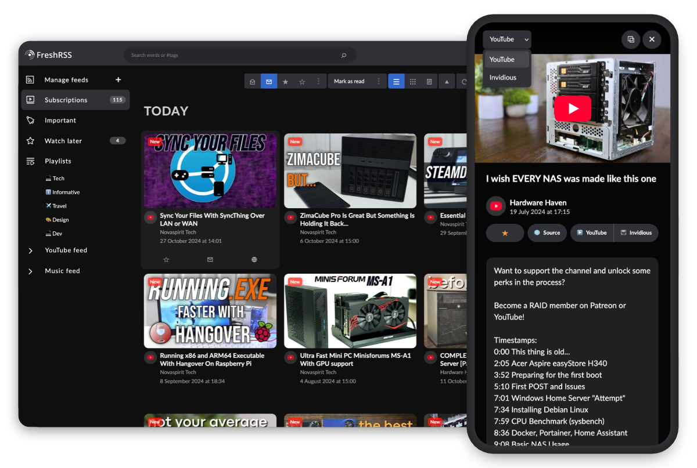

<h1 align="center">
  

   Youlag
    
   Video extension for FreshRSS
</h1>

   

## About
Youlag delivers a video-focused browsing experience for your YouTube RSS feeds in [FreshRSS](https://github.com/FreshRSS/FreshRSS), with a sleek theme and quality-of-life features.

While it also supports regular feeds, this setup is tailored specifically for video content. Feel free and set up a separate instance for your video feeds if needed.

## Table of Content
- [Features](#features)
- [Install](#install)
- [Additional Resources](#additional-resources)
- [Contribution](#contribution)
- [Attributions](#attributions)

## Features

- ⭐ **Optimized for Video Viewing**
  - Browse your YouTube, Invidious, Piped RSS subscriptions with ease.
  - Clean, familiar video platform layout.
  - Fullscreen viewing for videos and articles.
  - Quickly exit videos with `Esc` key.
  - Shortcuts for external viewing: "Invidious" and "YouTube".
  - Dark mode.
- 🖥️ **Desktop & Mobile**
  - Reponsive design.
  - Redesigned menus for better one-handed navigation.
  - Improved readability and legibility across devices.
- 📺 **Features Offered by FreshRSS:**
  - Subscribe to YouTube creators without an account.

### Planned
- [x] Minimize video, for background playback while browsing.
- [ ] Local video queue, but without autoplay due to CORS limitation.
- [x] Clickable links in video descriptions.
- [x] Convert to an actual FreshRSS extension, with options for customizing the view and features.
- [ ] Ability to specify which category to apply the video grid on, with the intention to only affect video feeds.

## Install

1. Download the [latest release here](https://github.com/civilblur/youlag/releases).

1. Unzip the file and you'll find a folder named `xExtension-Youlag`.

1. Move the `xExtension-Youlag` folder into your FreshRSS installation: `www/freshrss/extensions/`.

1. In FreshRSS, go to `Settings → Extensions` and enable the `Youlag` extension.
    - For [Invidious](https://invidious.io/) users, you can add your instance in the Youlag settings. This will allow you to choose which video source to play from when watching videos.

## Contribution

1. Fork and make changes to the `dev` branch.
1. Install dependencies: `npm i`.
1. Make changes to `src/script.js` or `src/theme.scss`.
    - Run `npm run watch` to compile `static/script.min.css` to `static/theme.min.css`.

## Attributions

- **Integration**: [Korbak/freshrss-invidious](https://github.com/Korbak/freshrss-invidious)
- **Icons used/remixed**: [SVG Repo](https://www.svgrepo.com/collection/design-and-development-elements/), [krystonschwarze](https://www.svgrepo.com/author/krystonschwarze/), [phosphor](https://www.svgrepo.com/author/phosphor/), [Solar Icons](https://www.svgrepo.com/svg/529779/playlist), [Dazzle UI](https://www.svgrepo.com/author/Dazzle%20UI/), [n3r4zzurr0/svg-spinners](https://github.com/n3r4zzurr0/svg-spinners).
- **Tools**: [SVGOptimizer](https://jakearchibald.github.io/svgomg/), [b64.io](https://b64.io/).
- **Featured channels on top image:** [Novaspirit Tech](https://www.youtube.com/channel/UCrjKdwxaQMSV_NDywgKXVmw), [Hardware Haven](https://www.youtube.com/channel/UCgdTVe88YVSrOZ9qKumhULQ).
   - Edit 2025-02-05: Rest in peace Don (Novaspirit Tech), thank you for your contribution to the community.

## License

GNU General Public License v3.0
