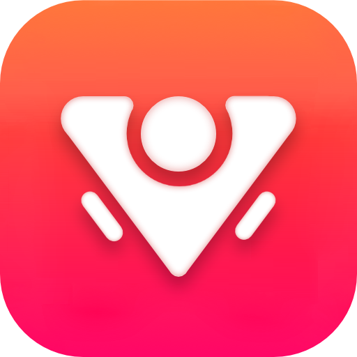
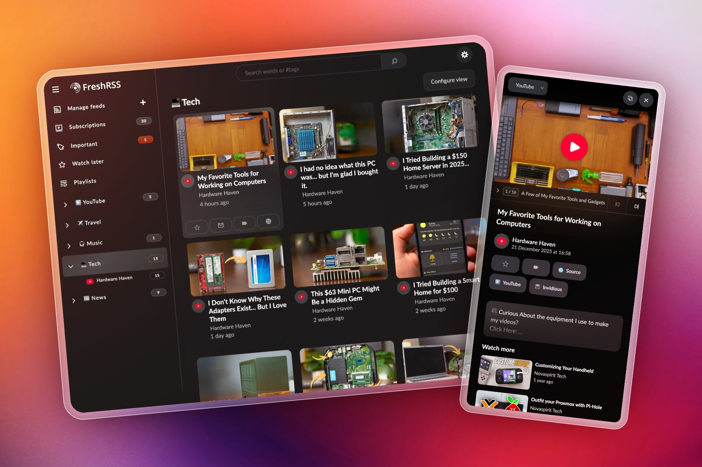
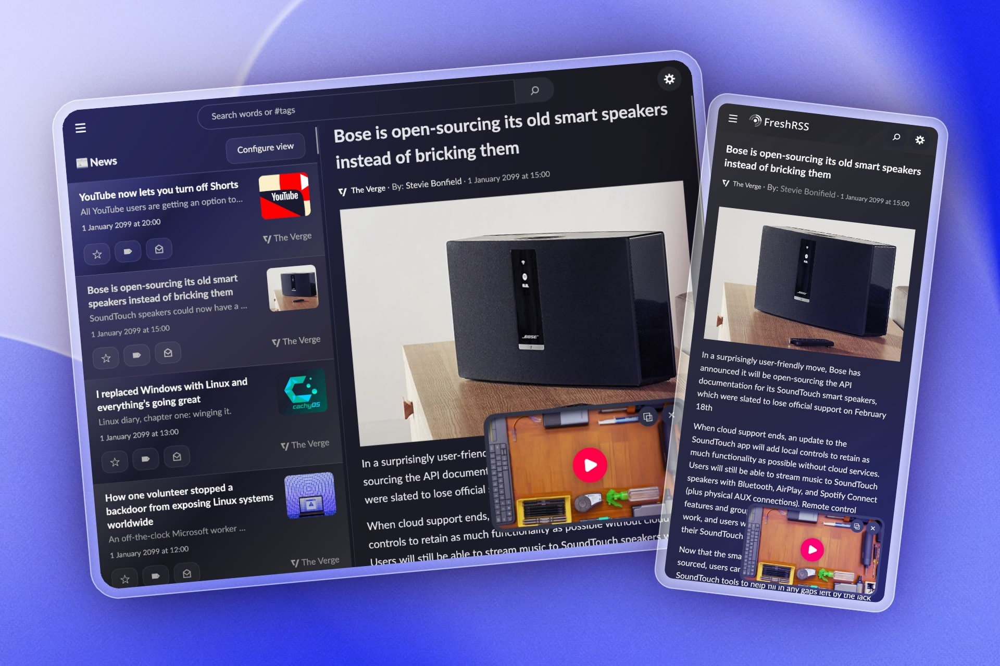

<h1 align="center">
  

Youlag

</h1>

<h2 align="center">
   Modernize FreshRSS for viewing YouTube and articles
</h2>

   
   

## About

Youlag is an extension for [FreshRSS](https://github.com/FreshRSS/FreshRSS), allowing you to browse YouTube and article RSS feeds through a modernized design that incorporates quality-of-life features.

It is designed for a distraction-free experience, for people who want to be intentional about their viewing habits.

## Why?

Subscribe to creators via RSS without a Google account, stay free of algorithms, and access your subscriptions from any device. Youlag can also be used just for article reading.

## Table of Content

- [Features](#features)
- [Install](#install)
- [Update](#update)
- [Keyboard shortcuts & gestures](#keyboard-shortcuts--gestures)
- [Contribution](#contribution)
- [Attributions](#attributions)

## Features

- 📺 **Videos & Articles**
  - Browse YouTube subscriptions in a video-focused interface
  - Auto-skip sponsored segments and chapters you choose
  - Replace clickbait titles, and thumbnails with screencaps
  - Miniplayer: keep video in corner while reading articles
  - Modern article reading experience
- ⚙️ **Customization**
  - Block YouTube shorts
  - Video mode for chosen categories
  - Play via YouTube or [Invidious](https://invidious.io/)
  - Hide sponsored links in video description intros
- 🖥️ **Desktop & Mobile**
  - Browse and view articles side by side
  - [Keyboard shortcuts & gestures](#keyboard-shortcuts--gestures)
- 📰 **FreshRSS features**
  - Subscribe to YouTube creators without an account
  - Manage article and video RSS feeds

## Install

Youlag is an extension for [FreshRSS](https://github.com/FreshRSS/FreshRSS) and requires version `1.30.0` or higher.

1. Download the [latest release here](https://github.com/civilblur/youlag/releases).

1. Unzip the file and you'll find a folder named `xExtension-Youlag`.

1. Move the `xExtension-Youlag` folder into your FreshRSS installation: `freshrss/extensions/`.

1. In FreshRSS, go to `Settings → Extensions` and enable the `Youlag` extension.
   - Click the gear (⚙️) icon to explore the available settings.

## Update

1. Delete the old version of Youlag: `freshrss/extensions/xExtension-Youlag`.

1. Repeat the same steps from the ["Install" instructions](#install).

## Keyboard shortcuts & gestures

### Keyboard shortcuts

These shortcuts control the video in video mode. Clicking on the video hands the keyboard over to YouTube's player, so click anywhere outside the video to use these shortcuts again.

- `Space`: play/pause
- `←` `→`: seek 5s
- `Ctrl`/`Option` + `←` `→`: previous/next chapter
  - `Ctrl` on Windows and Linux, `Option` on macOS.
- `M`: mute
- `I`: miniplayer
- `Esc`: close video or article
  - The browser's `Back` navigation works too.

### Touch gestures

- In an open video, swipe down to switch to the miniplayer.
  - Swipe outside the video itself. Swipes on the video aren't recognized.
- From the left edge of the screen, swipe right to open the sidebar.
  - To close, swipe left on the sidebar.

## Contribution

1. Fork the `dev` branch.
1. Install dependencies: `npm i`.
1. Run `npm run watch` to compile files to `/static`.
   1. For local development, see `.env.example` to learn how you can sync your changes directly to FreshRSS' extensions folder.
1. Run `npm run build` to generate a production build to `/dist`.

## Attributions

- **Integration**: [Korbak/freshrss-invidious](https://github.com/Korbak/freshrss-invidious), [ajayyy/DeArrow](https://github.com/ajayyy/DeArrow), [ajayyy/SponsorBlock](https://github.com/ajayyy/SponsorBlock)
- **Icons used/remixed**: [SVG Repo](https://www.svgrepo.com/collection/design-and-development-elements/), [krystonschwarze](https://www.svgrepo.com/author/krystonschwarze/), [phosphor](https://www.svgrepo.com/author/phosphor/), [Solar Icons](https://www.svgrepo.com/svg/529779/playlist), [Dazzle UI](https://www.svgrepo.com/author/Dazzle%20UI/), [n3r4zzurr0/svg-spinners](https://github.com/n3r4zzurr0/svg-spinners).
- **Tools**: [SVGOptimizer](https://jakearchibald.github.io/svgomg/).

## License

GNU General Public License v3.0
